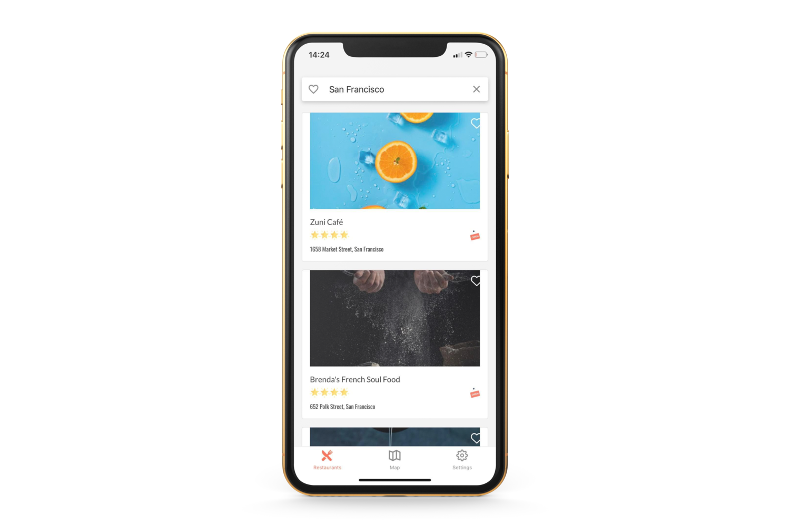
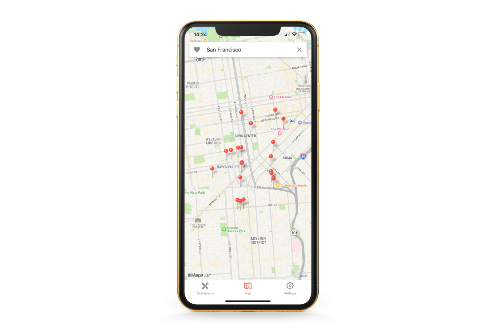
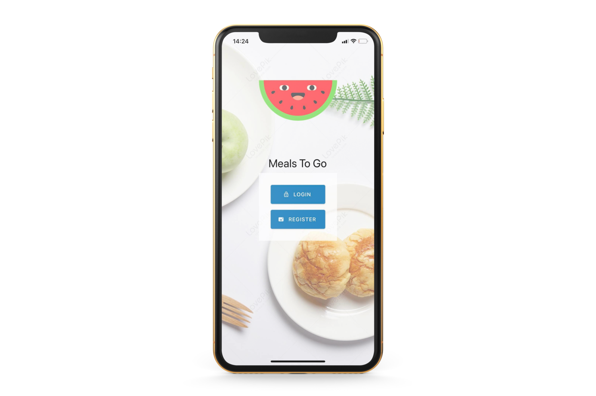

<p align="center">
  <h3 align="center">React Native Meals To Go App</h3>

  <p align="center">
React Native App with restaurants, user can search for city and get restaurants from there, also user can opan map
and take a look on the location of individual restaurants. User can login or register using Firebase Auth.
    <br />
  </p>
</p>

## About The Project


<br>

<br>

<br>

### Installing

Clone the Repository and run

```
npm install
npm start
```

### Built With

-  React Native
-  Firebase
-  Expo
-  React-native-paper
-  Styled-Components
